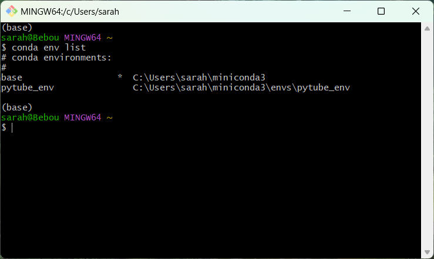
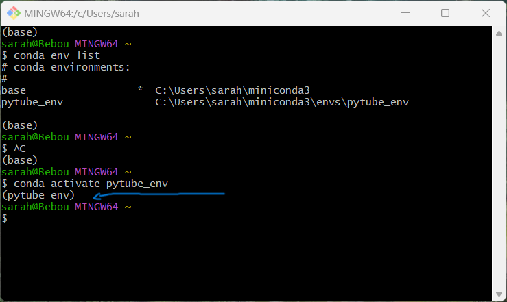

# How to create an environnement (with conda)

To look for every conda environnement in your pc enter this in your terminal :
```sh
conda env list
```
You should have something like this :



Of cours here you can notice I already have two environnements, one called base wich is my main one (and the one you should never remove it), and one called "Pytube_env" to use a certain version of Python. Conda environnement allow you to use speacials settings for a specific project. It's much like the blank canva all prepared for you to paint on. 

## To actually create an environnement 

First ask yourself these questions : 
* What version of what would you like to use for this project ?
* What is the name of your project ? (don't use spaces or weird french things)

> To create an environnement with the same settings of your base environnement just write the command without specifications

Then you can type this in your terminal :

```sh
conda create --name $project_name_env python 
```
For a specific version of python (in this case 3.10) :

```sh
conda create --name $project_name_env python=3.10
```
With Pandas to read and write CSV files : 

```sh
conda create --name $project_name_env python pandas
```
You can check if you created it with the listing command :
```sh
conda env list
```

## To call your environnement **each** time you start your project : 

**Each** time you start working on your project you will need to call your environnement. In order to do so, this is the command you will use in your terminal :

```sh
conda activate $project_name_env 
```

The base environnement should have been replaced with your project one. You should have something like this :



As you can see, the (base) above my name is now (pytibe_env). 

:sunglasses: You did it!